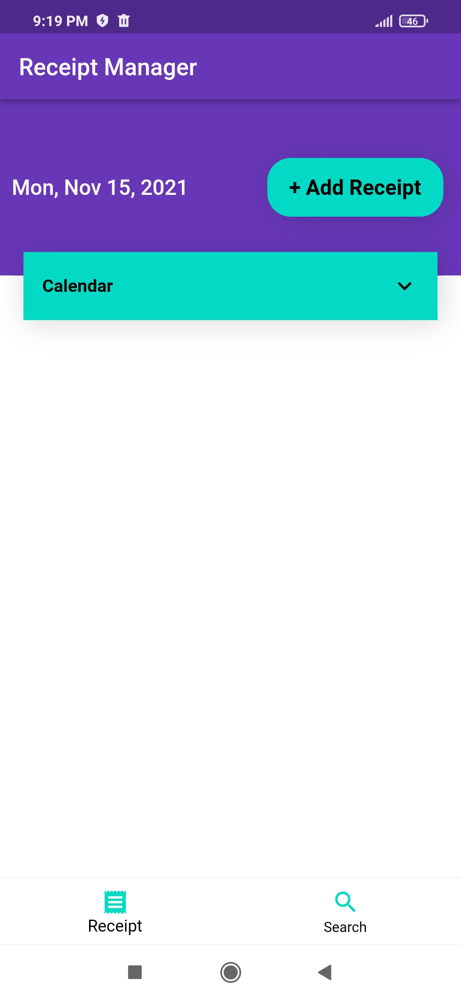
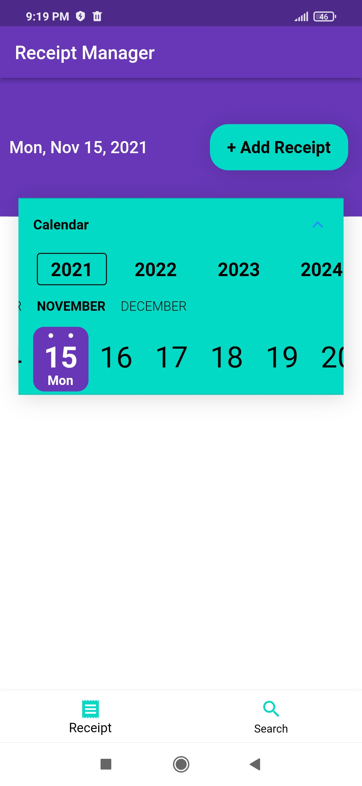
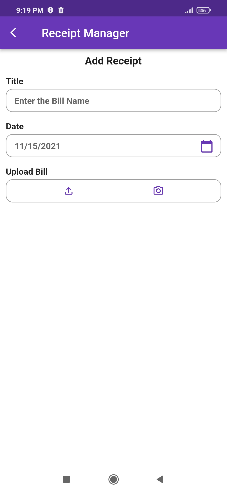
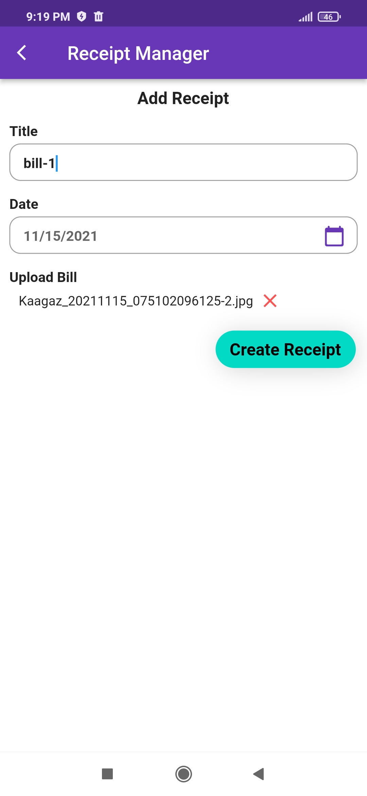
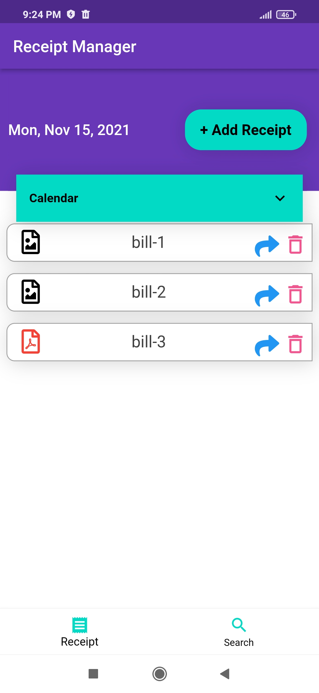
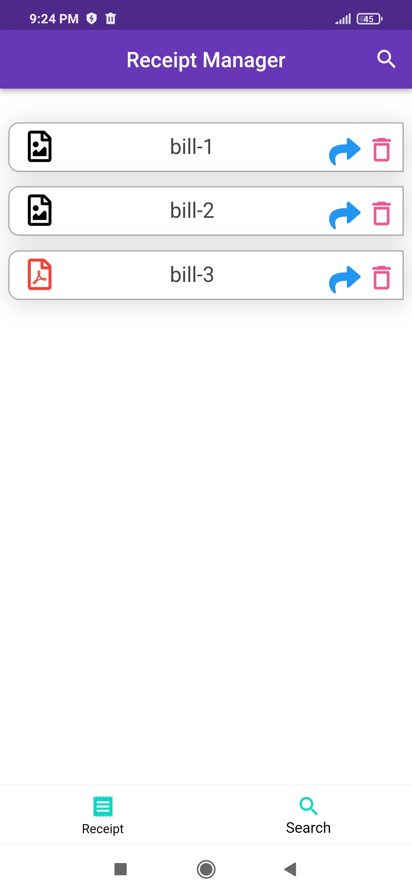
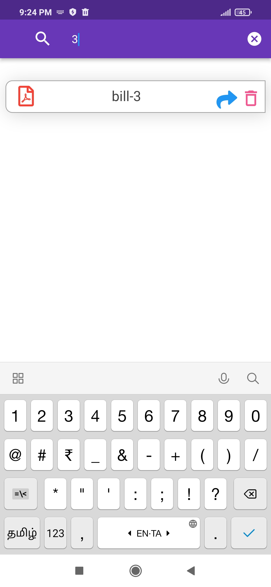
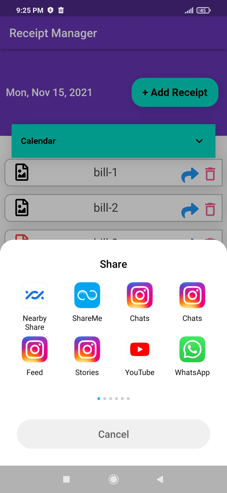

## Receipt Manager
    - To maintain the every day bills date wise in the format of image or pdf.

## Features
    - Bill capture through camera
    - search functionality 
    - share the bills to other mediums like whatsapp, email ...etc
    - open to view the bills

# Application Images

      
   
  